# GitHub Pagesへのデプロイ

## やりかた

1. [2022-web-profile](https://github.com/kmc-jp/2022-web-profile) をforkします

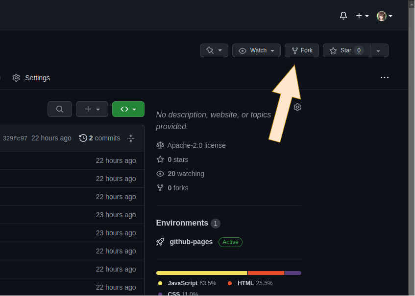

2. そのままの設定で良いので、「Create fork」を押します

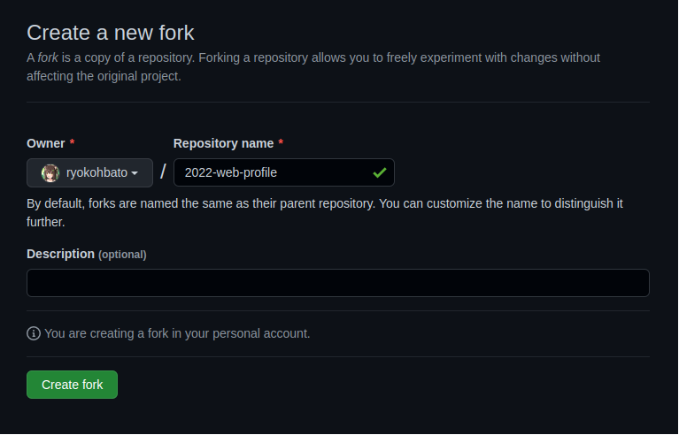

3. 「Actions」タブに移動します

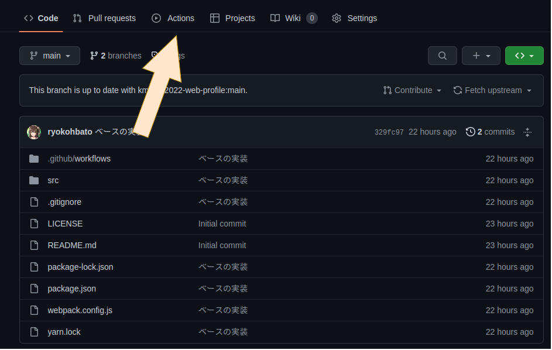

4. 「I understand my workflows, go ahead and enable them」を押して、ワークフローを有効化します

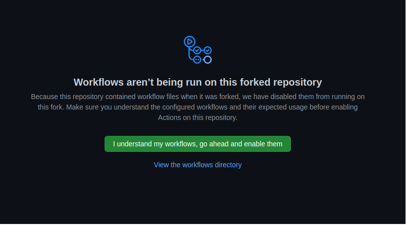

5. 続いて「Settings」に移動します

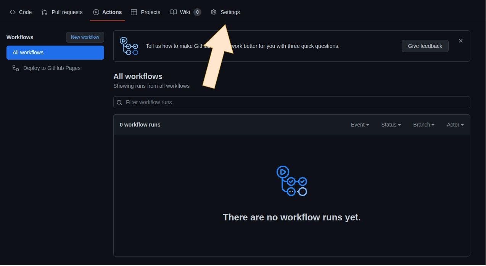

6. 「Pages」へ移動します

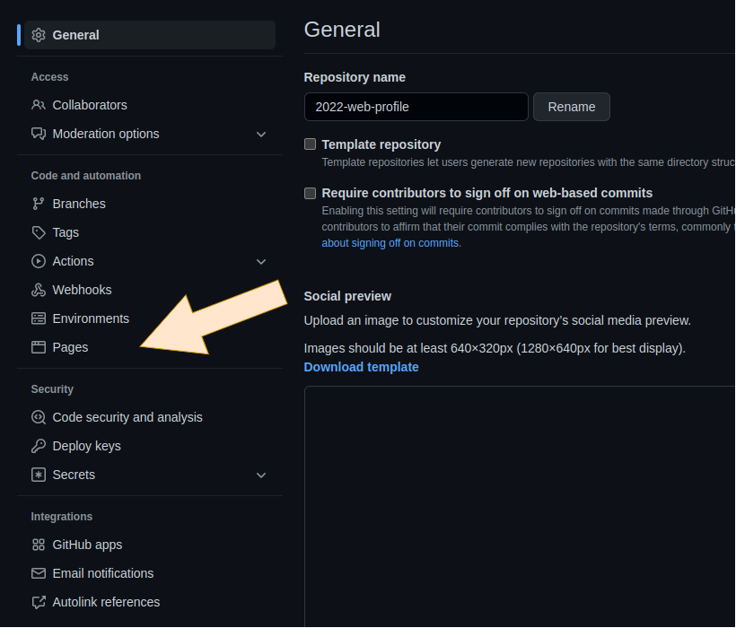

7. Sourceが「None」に設定されているはずなので、「gh-pages」に変更します。

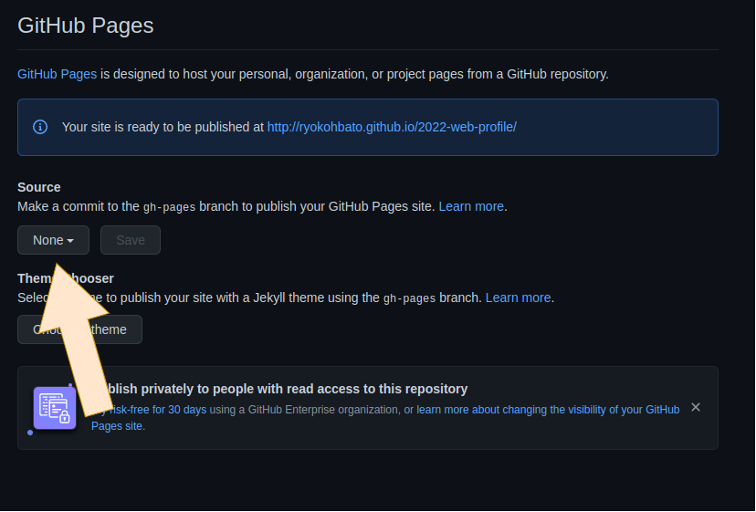

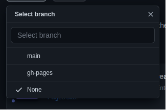

8. 変更できたら「Save」を押します

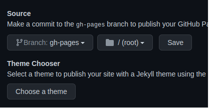

9. 「Actions」タブに戻ります

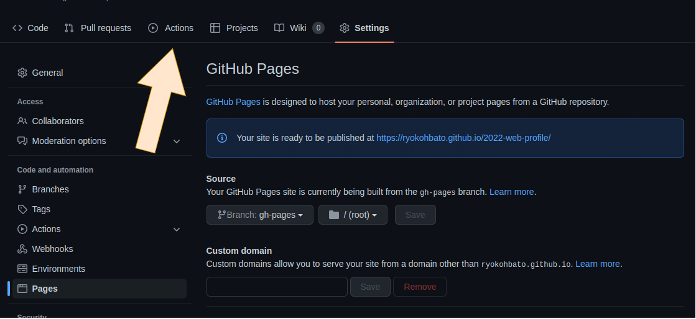

10. 「pages build and deployment」があると思うのでこれを押します

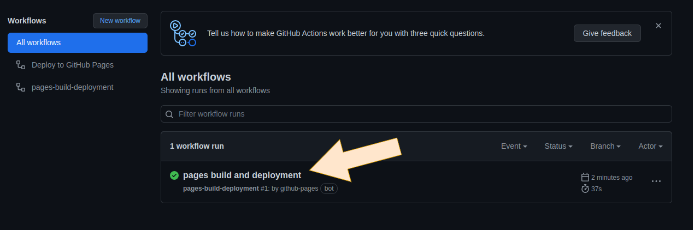

11. 「deploy」欄に記載されているURLを押します

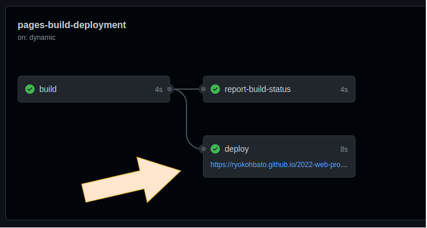

12. このようにページが表示されていればOKです

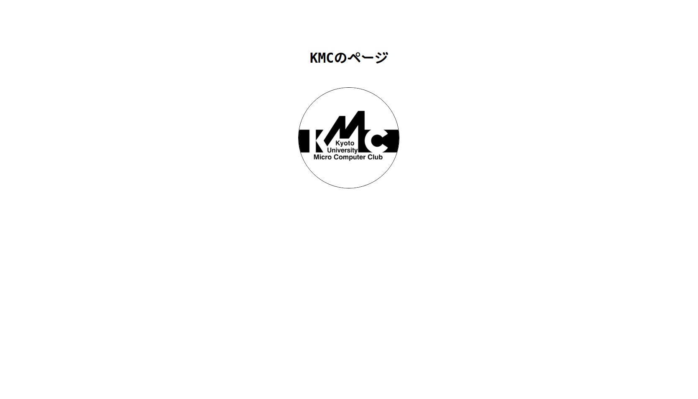

このページは、`main` ブランチに変更がpushされると自動的に内容が更新されるようになっています

## ページの編集

**forkしたリポジトリを** cloneします

`src/index.html` にHTML、`src/style.css` にCSS、`src/images/` 以下に画像を配置します

開発環境の立ち上げ方は、[kmc-jp/2022-web-profile](https://github.com/kmc-jp/2022-web-profile) に記載されているのでそちらをどうぞ
