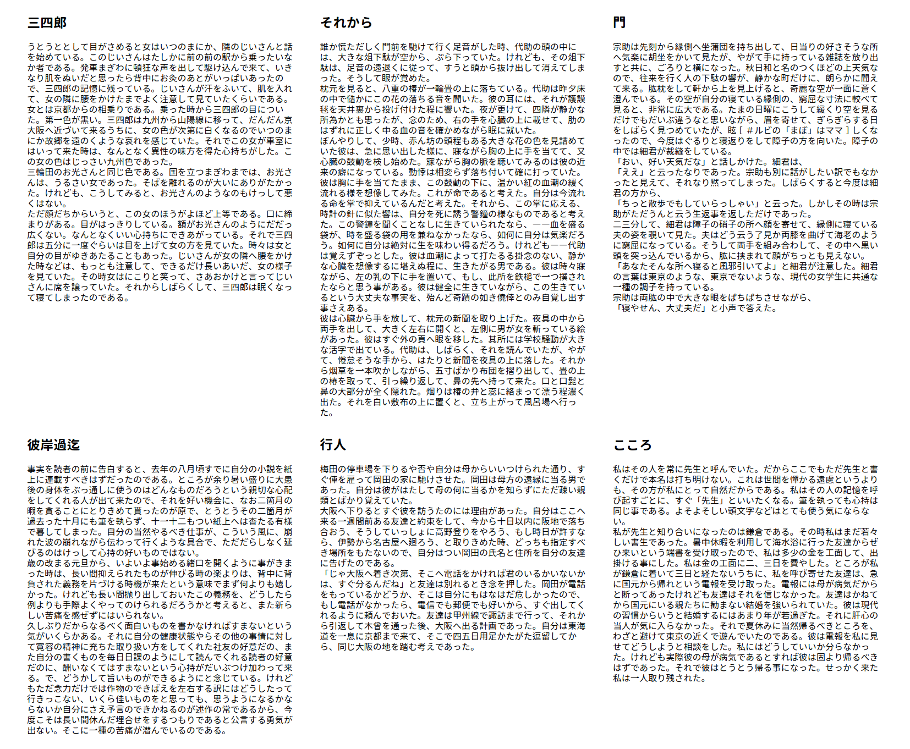
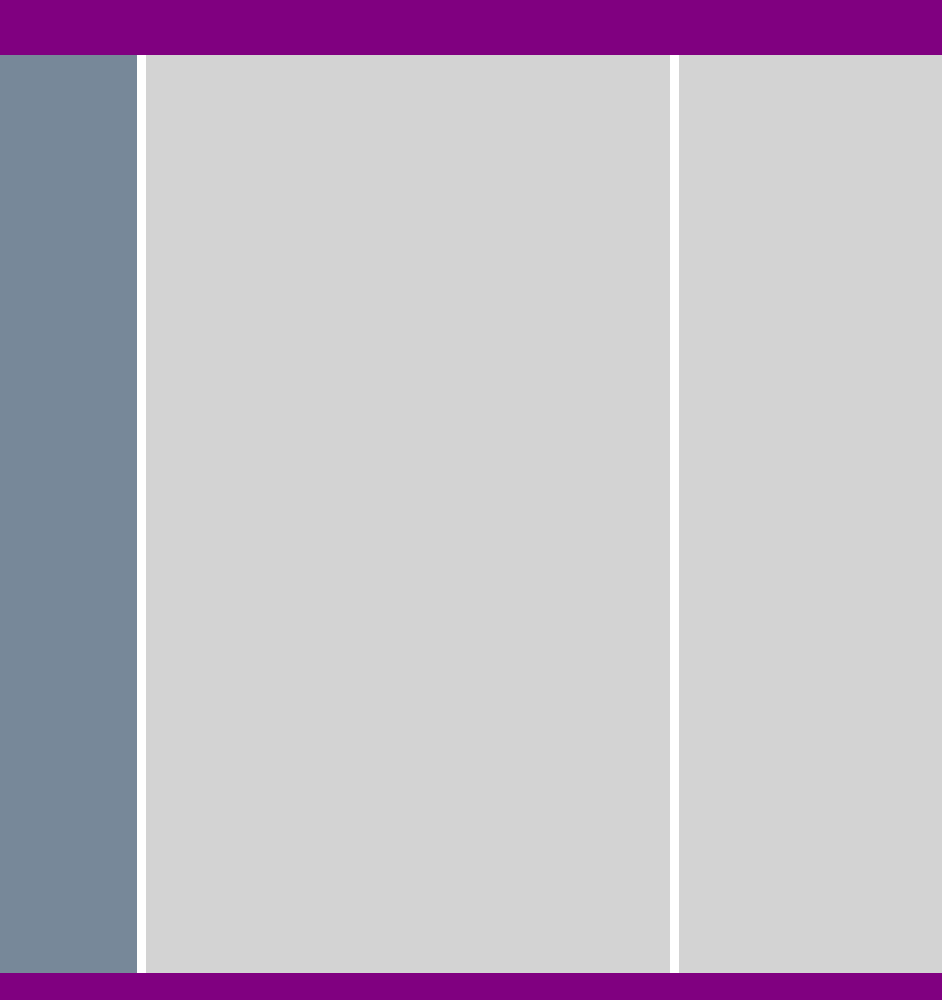

# 第7回 レイアウトのまとめ

## 開発環境について

[第7回 開発環境構築手順](https://github.com/kmc-jp/2022-web/blob/main/section-template/section-07/README.md) を参照

復習も含めて、CSSでレイアウトを作る手法をまとめます。

## 横並べレイアウト

かつては横並べレイアウトに `float` プロパティが使用されていましたが、フレックスボックスやグリッドレイアウトなどが用いられるようになったため、現在ではこの用途ではほとんど使われません。

> [float | MDN](https://developer.mozilla.org/ja/docs/Web/CSS/float)

以下のようなデザインを考えましょう。



さて、HTMLは簡単に以下のようにしておきましょう。

```html
  <body>
    <div class="article-container">
      <article class="article-item">
        <h2>三四郎</h2>
        <p>
          うとうととして目がさめると女はいつのまにか、隣のじいさんと話を始めている。このじいさんはたしかに前の前の駅から乗ったいなか者である。発車まぎわに頓狂な声を出して駆け込んで来て、いきなり肌をぬいだと思ったら背中にお灸のあとがいっぱいあったので、三四郎の記憶に残っている。じいさんが汗をふいて、肌を入れて、女の隣に腰をかけたまでよく注意して見ていたくらいである。<br />
          女とは京都からの相乗りである。乗った時から三四郎の目についた。第一色が黒い。三四郎は九州から山陽線に移って、だんだん京大阪へ近づいて来るうちに、女の色が次第に白くなるのでいつのまにか故郷を遠のくような哀れを感じていた。それでこの女が車室にはいって来た時は、なんとなく異性の味方を得た心持ちがした。この女の色はじっさい九州色であった。<br />
          三輪田のお光さんと同じ色である。国を立つまぎわまでは、お光さんは、うるさい女であった。そばを離れるのが大いにありがたかった。けれども、こうしてみると、お光さんのようなのもけっして悪くはない。<br />
          ただ顔だちからいうと、この女のほうがよほど上等である。口に締まりがある。目がはっきりしている。額がお光さんのようにだだっ広くない。なんとなくいい心持ちにできあがっている。それで三四郎は五分に一度ぐらいは目を上げて女の方を見ていた。時々は女と自分の目がゆきあたることもあった。じいさんが女の隣へ腰をかけた時などは、もっとも注意して、できるだけ長いあいだ、女の様子を見ていた。その時女はにこりと笑って、さあおかけと言ってじいさんに席を譲っていた。それからしばらくして、三四郎は眠くなって寝てしまったのである。<br />
        </p>
      </article>

      <article class="article-item">
        <h2>それから</h2>
        <p>
          誰か慌ただしく門前を馳けて行く足音がした時、代助の頭の中には、大きな俎下駄が空から、ぶら下っていた。けれども、その俎下駄は、足音の遠退くに従って、すうと頭から抜け出して消えてしまった。そうして眼が覚めた。<br />
          枕元を見ると、八重の椿が一輪畳の上に落ちている。代助は昨夕床の中で慥かにこの花の落ちる音を聞いた。彼の耳には、それが護謨毬を天井裏から投げ付けた程に響いた。夜が更けて、四隣が静かな所為かとも思ったが、念のため、右の手を心臓の上に載せて、肋のはずれに正しく中る血の音を確かめながら眠に就いた。<br />
          ぼんやりして、少時、赤ん坊の頭程もある大きな花の色を見詰めていた彼は、急に思い出した様に、寐ながら胸の上に手を当てて、又心臓の鼓動を検し始めた。寐ながら胸の脈を聴いてみるのは彼の近来の癖になっている。動悸は相変らず落ち付いて確に打っていた。彼は胸に手を当てたまま、この鼓動の下に、温かい紅の血潮の緩く流れる様を想像してみた。これが命であると考えた。自分は今流れる命を掌で抑えているんだと考えた。それから、この掌に応える、時計の針に似た響は、自分を死に誘う警鐘の様なものであると考えた。この警鐘を聞くことなしに生きていられたなら、――血を盛る袋が、時を盛る袋の用を兼ねなかったなら、如何に自分は気楽だろう。如何に自分は絶対に生を味わい得るだろう。けれども――代助は覚えずぞっとした。彼は血潮によって打たるる掛念のない、静かな心臓を想像するに堪えぬ程に、生きたがる男である。彼は時々寐ながら、左の乳の下に手を置いて、もし、此所を鉄槌で一つ撲されたならと思う事がある。彼は健全に生きていながら、この生きているという大丈夫な事実を、殆んど奇蹟の如き僥倖とのみ自覚し出す事さえある。<br />
          彼は心臓から手を放して、枕元の新聞を取り上げた。夜具の中から両手を出して、大きく左右に開くと、左側に男が女を斬っている絵があった。彼はすぐ外の頁へ眼を移した。其所には学校騒動が大きな活字で出ている。代助は、しばらく、それを読んでいたが、やがて、惓怠そうな手から、はたりと新聞を夜具の上に落した。それから烟草を一本吹かしながら、五寸ばかり布団を摺り出して、畳の上の椿を取って、引っ繰り返して、鼻の先へ持って来た。口と口髭と鼻の大部分が全く隠れた。烟りは椿の弁と蕊に絡まって漂う程濃く出た。それを白い敷布の上に置くと、立ち上がって風呂場へ行った。
        </p>
      </article>

      <article class="article-item">
        <h2>門</h2>
        <p>
          宗助は先刻から縁側へ坐蒲団を持ち出して、日当りの好さそうな所へ気楽に胡坐をかいて見たが、やがて手に持っている雑誌を放り出すと共に、ごろりと横になった。秋日和と名のつくほどの上天気なので、往来を行く人の下駄の響が、静かな町だけに、朗らかに聞えて来る。肱枕をして軒から上を見上げると、奇麗な空が一面に蒼く澄んでいる。その空が自分の寝ている縁側の、窮屈な寸法に較べて見ると、非常に広大である。たまの日曜にこうして緩くり空を見るだけでもだいぶ違うなと思いながら、眉を寄せて、ぎらぎらする日をしばらく見つめていたが、眩［＃ルビの「まぼ」はママ］しくなったので、今度はぐるりと寝返りをして障子の方を向いた。障子の中では細君が裁縫をしている。<br />
          「おい、好い天気だな」と話しかけた。細君は、<br />
          「ええ」と云ったなりであった。宗助も別に話がしたい訳でもなかったと見えて、それなり黙ってしまった。しばらくすると今度は細君の方から、<br />
          「ちっと散歩でもしていらっしゃい」と云った。しかしその時は宗助がただうんと云う生返事を返しただけであった。<br />
          二三分して、細君は障子の硝子の所へ顔を寄せて、縁側に寝ている夫の姿を覗いて見た。夫はどう云う了見か両膝を曲げて海老のように窮屈になっている。そうして両手を組み合わして、その中へ黒い頭を突っ込んでいるから、肱に挟まれて顔がちっとも見えない。<br />
          「あなたそんな所へ寝ると風邪引いてよ」と細君が注意した。細君の言葉は東京のような、東京でないような、現代の女学生に共通な一種の調子を持っている。<br />
          宗助は両肱の中で大きな眼をぱちぱちさせながら、<br />
          「寝やせん、大丈夫だ」と小声で答えた。
        </p>
      </article>

      <article class="article-item">
        <h2>彼岸過迄</h2>
        <p>
          事実を読者の前に告白すると、去年の八月頃すでに自分の小説を紙上に連載すべきはずだったのである。ところが余り暑い盛りに大患後の身体をぶっ通しに使うのはどんなものだろうという親切な心配をしてくれる人が出て来たので、それを好い機会に、なお二箇月の暇を貪ることにとりきめて貰ったのが原で、とうとうその二箇月が過去った十月にも筆を執らず、十一十二もつい紙上へは杳たる有様で暮してしまった。自分の当然やるべき仕事が、こういう風に、崩れた波の崩れながら伝わって行くような具合で、ただだらしなく延びるのはけっして心持の好いものではない。<br />
          歳の改まる元旦から、いよいよ事始める緒口を開くように事がきまった時は、長い間抑えられたものが伸びる時の楽よりは、背中に背負された義務を片づける時機が来たという意味でまず何よりも嬉しかった。けれども長い間抛り出しておいたこの義務を、どうしたら例よりも手際よくやってのけられるだろうかと考えると、また新らしい苦痛を感ぜずにはいられない。<br />
          久しぶりだからなるべく面白いものを書かなければすまないという気がいくらかある。それに自分の健康状態やらその他の事情に対して寛容の精神に充ちた取り扱い方をしてくれた社友の好意だの、また自分の書くものを毎日日課のようにして読んでくれる読者の好意だのに、酬いなくてはすまないという心持がだいぶつけ加わって来る。で、どうかして旨いものができるようにと念じている。けれどもただ念力だけでは作物のできばえを左右する訳にはどうしたって行きっこない、いくら佳いものをと思っても、思うようになるかならないか自分にさえ予言のできかねるのが述作の常であるから、今度こそは長い間休んだ埋合せをするつもりであると公言する勇気が出ない。そこに一種の苦痛が潜んでいるのである。
        </p>
      </article>

      <article class="article-item">
        <h2>行人</h2>
        <p>
          梅田の停車場を下りるや否や自分は母からいいつけられた通り、すぐ俥を雇って岡田の家に馳けさせた。岡田は母方の遠縁に当る男であった。自分は彼がはたして母の何に当るかを知らずにただ疎い親類とばかり覚えていた。<br />
          大阪へ下りるとすぐ彼を訪うたのには理由があった。自分はここへ来る一週間前ある友達と約束をして、今から十日以内に阪地で落ち合おう、そうしていっしょに高野登りをやろう、もし時日が許すなら、伊勢から名古屋へ廻ろう、と取りきめた時、どっちも指定すべき場所をもたないので、自分はつい岡田の氏名と住所を自分の友達に告げたのである。<br />
          「じゃ大阪へ着き次第、そこへ電話をかければ君のいるかいないかは、すぐ分るんだね」と友達は別れるとき念を押した。岡田が電話をもっているかどうか、そこは自分にもはなはだ危しかったので、もし電話がなかったら、電信でも郵便でも好いから、すぐ出してくれるように頼んでおいた。友達は甲州線で諏訪まで行って、それから引返して木曾を通った後、大阪へ出る計画であった。自分は東海道を一息に京都まで来て、そこで四五日用足かたがた逗留してから、同じ大阪の地を踏む考えであった。
        </p>
      </article>

      <article class="article-item">
        <h2>こころ</h2>
        <p>
          私はその人を常に先生と呼んでいた。だからここでもただ先生と書くだけで本名は打ち明けない。これは世間を憚かる遠慮というよりも、その方が私にとって自然だからである。私はその人の記憶を呼び起すごとに、すぐ「先生」といいたくなる。筆を執っても心持は同じ事である。よそよそしい頭文字などはとても使う気にならない。<br />
          私が先生と知り合いになったのは鎌倉である。その時私はまだ若々しい書生であった。暑中休暇を利用して海水浴に行った友達からぜひ来いという端書を受け取ったので、私は多少の金を工面して、出掛ける事にした。私は金の工面に二、三日を費やした。ところが私が鎌倉に着いて三日と経たないうちに、私を呼び寄せた友達は、急に国元から帰れという電報を受け取った。電報には母が病気だからと断ってあったけれども友達はそれを信じなかった。友達はかねてから国元にいる親たちに勧まない結婚を強いられていた。彼は現代の習慣からいうと結婚するにはあまり年が若過ぎた。それに肝心の当人が気に入らなかった。それで夏休みに当然帰るべきところを、わざと避けて東京の近くで遊んでいたのである。彼は電報を私に見せてどうしようと相談をした。私にはどうしていいか分らなかった。けれども実際彼の母が病気であるとすれば彼は固より帰るべきはずであった。それで彼はとうとう帰る事になった。せっかく来た私は一人取り残された。
        </p>
      </article>
    </div>
  </body>
```

単に横に並べるだけであれば、`display: inline-block` で十分です。

```css
.article-item {
  display: inline-block;
  vertical-align: top;
  width: 30%;
}
```

しかし、これでは右側に余白が生まれてしまいます。これは、幅が30%しかないためです。しかし、幅を33%に指定すると、3つが横並びになってくれません。

実はこの問題は、以下のようなややトリッキーな方法で解決できます。

```css
body {
  font-size: 0;
}

.article-item {
  font-size: 16px;
  display: inline-block;
  vertical-align: top;
  width: calc(100% / 3);
}
```

### フレックスボックス

フレックスボックスを使うには、親要素に `display: flex` を指定します。

```css
.article-container {
  display: flex;
}
```

これだけで横並びになりました。しかし、6つは多すぎるので、3つを2段に分けて並べましょう。

例えば以下のようにすれば、画面幅の30%の大きさで3つの要素が並び、余白も全箇所が等幅になるように自動で調整されます。

```css
.article-container {
  display: flex;
  flex-wrap: wrap;
  justify-content: space-evenly;
}

.article-item {
  flex: 0 0 30%;
}
```

ただしこの場合、画面幅を狭くすると見づらくなってしまうことに注意してください。どれだけ画面幅を狭くしても、横に3つ並び続けてしまうからです。

これを解消するために、各アイテムの最小幅を300pxに指定しましょう。

```css
.article-container {
  display: flex;
  flex-wrap: wrap;
  justify-content: space-evenly;
}

.article-item {
  flex: 0 0 30%;
  min-width: 300px;
}
```

画面幅を狭くすると、自動で折返しと余白が調整されます。

さて、もう少し詳しく見ていきましょう。

`flex-wrap: wrap;` は、要素の折返しを指定しています。これを指定しないと、横にはみ出すだけで折り返してくれません。

> [flex-wrap | MDN](https://developer.mozilla.org/ja/docs/Web/CSS/flex-wrap)

`justify-content: space-evenly;` は、各アイテムを均等に配置しつつ、各アイテムの周りにもそれと同じ大きさの間隔を設定しています。

中央寄せや左寄せ・右寄せなども設定できます。

> [justify-content | MDN](https://developer.mozilla.org/ja/docs/Web/CSS/justify-content)

`flex: 0 0 30%;` は、要素の大きさを指定しています。`flex` プロパティは、`flex-grow`, `flex-shrink`, `flex-basis` の一括指定プロパティです。

`flex-grow` は、要素がどの程度引き伸ばされるかを指定します。今回は、画面幅の30%という決まった値を指定したいので、勝手に引き伸ばされてほしくありません。そこで、`flex-grow: 0;` を指定することで引き伸ばしを無効にしています。

`flex-shrink` は、要素の縮小度合いを指定します。縮小させる必要はないので、`flex-shrink: 0;` を指定しています。

`flex-basis` は初期寸法を指定します。`flex-basis: 30vw;` を指定しているので初期寸法は画面幅の30%です。ここに `flex-grow: 0;` で指定した引き伸ばしの無効化、`flex-shrink: 0;` で指定した伸縮の無効化が組み合わさって、最終的な要素のサイズが画面幅の30%と決まります。

> [flex | MDN](https://developer.mozilla.org/ja/docs/Web/CSS/flex)

> [flex-grow | MDN](https://developer.mozilla.org/ja/docs/Web/CSS/flex-grow)

> [flex-shrink](https://developer.mozilla.org/ja/docs/Web/CSS/flex-shrink)

> [flex-basis](https://developer.mozilla.org/ja/docs/Web/CSS/flex-basis)

### グリッドレイアウト

以下のようなレイアウトを組むことを考えましょう。

2箇所の薄い灰色の領域は、それぞれ余白に応じて大きさが変わり、横幅は常に2:1を保っているものとします。



今回もHTMLは簡単に、以下のようにしましょう。

```html
  <body>
    <header class="header"></header>
    <nav class="navigation"></nav>
    <main class="content"></main>
    <article class="sub-content"></article>
    <footer class="footer"></footer>
  </body>
```

グリッドレイアウトでは、視覚的にCSSの中にレイアウトを記述することができます。

以下のようにして、レイアウトの概形をそのままCSSに書いていきます。

```css
body {
  display: grid;
  grid-template:
    "header header header header header" 96px
    "navigation . content . sub-content" 150vh
    "footer footer footer footer footer" 48px
    / 240px 16px 2fr 16px 1fr;
}

.header {
  background-color: purple;
  grid-area: header;
}

.content {
  background-color: lightgray;
  grid-area: content;
}

.navigation {
  background-color: lightslategray;
  grid-area: navigation;
}

.footer {
  background-color: purple;
  grid-area: footer;
}
```

ここで、`fr` という新しい単位が出てきました。これは、余った領域を分配する単位です。画面の横幅を、`240px`, `16px`, `2fr`, `16px`, `1fr` で取り合う際に、`240px`, `16px`, `16px` の3つを差し引いた上で余った幅のうち 2/3が `2fr`, 1/3が `1fr` に割り当てられるという便利な単位です。

この記法では、領域に個別に名前を付けて適用させるだけで自動的に配置され、`.` で余白も簡単に指定できます。

ちなみに、レイアウトを直接記載しない記法もあります。

#### user agent stylesheet

さてここで、何も指定していないのに最も外側に余白が生まれていることに気づくかと思います。これはブラウザが始めから指定している、`body` タグの `margin` です。これは user agent stylesheet と呼びます。`h1` タグが太字の大文字で描画されたり、`a` タグが下線付きの青色の文字で描画されるのも、この user agent stylesheet のおかげで、これがあるために、CSSのあたっていないHTMLもそれなりに見やすく表示してくれます。

しかし、レイアウトにこだわる際には、user agent stylesheet が邪魔になることも多く、また、user agent stylesheet はブラウザごとに異なるため、ブラウザ間で挙動が変わる原因にもなります。そこで、Reset CSS や Normalize CSS などと呼ばれるCSSをあてて、user agent stylesheet をリセットしたり、ブラウザ間の差異を埋めたりします。

> [necolas/normalize.css](https://github.com/necolas/normalize.css)

### 段組み

さて、ここまで紹介したものよりもより自由なレイアウトも紹介しておきましょう。

再びHTMLはこちらを用います。

```html
  <body>
    <div class="article-container">
      <article class="article-item">
        <h2>三四郎</h2>
        <p>
          うとうととして目がさめると女はいつのまにか、隣のじいさんと話を始めている。このじいさんはたしかに前の前の駅から乗ったいなか者である。発車まぎわに頓狂な声を出して駆け込んで来て、いきなり肌をぬいだと思ったら背中にお灸のあとがいっぱいあったので、三四郎の記憶に残っている。じいさんが汗をふいて、肌を入れて、女の隣に腰をかけたまでよく注意して見ていたくらいである。<br />
          女とは京都からの相乗りである。乗った時から三四郎の目についた。第一色が黒い。三四郎は九州から山陽線に移って、だんだん京大阪へ近づいて来るうちに、女の色が次第に白くなるのでいつのまにか故郷を遠のくような哀れを感じていた。それでこの女が車室にはいって来た時は、なんとなく異性の味方を得た心持ちがした。この女の色はじっさい九州色であった。<br />
          三輪田のお光さんと同じ色である。国を立つまぎわまでは、お光さんは、うるさい女であった。そばを離れるのが大いにありがたかった。けれども、こうしてみると、お光さんのようなのもけっして悪くはない。<br />
          ただ顔だちからいうと、この女のほうがよほど上等である。口に締まりがある。目がはっきりしている。額がお光さんのようにだだっ広くない。なんとなくいい心持ちにできあがっている。それで三四郎は五分に一度ぐらいは目を上げて女の方を見ていた。時々は女と自分の目がゆきあたることもあった。じいさんが女の隣へ腰をかけた時などは、もっとも注意して、できるだけ長いあいだ、女の様子を見ていた。その時女はにこりと笑って、さあおかけと言ってじいさんに席を譲っていた。それからしばらくして、三四郎は眠くなって寝てしまったのである。<br />
        </p>
      </article>

      <article class="article-item">
        <h2>それから</h2>
        <p>
          誰か慌ただしく門前を馳けて行く足音がした時、代助の頭の中には、大きな俎下駄が空から、ぶら下っていた。けれども、その俎下駄は、足音の遠退くに従って、すうと頭から抜け出して消えてしまった。そうして眼が覚めた。<br />
          枕元を見ると、八重の椿が一輪畳の上に落ちている。代助は昨夕床の中で慥かにこの花の落ちる音を聞いた。彼の耳には、それが護謨毬を天井裏から投げ付けた程に響いた。夜が更けて、四隣が静かな所為かとも思ったが、念のため、右の手を心臓の上に載せて、肋のはずれに正しく中る血の音を確かめながら眠に就いた。<br />
          ぼんやりして、少時、赤ん坊の頭程もある大きな花の色を見詰めていた彼は、急に思い出した様に、寐ながら胸の上に手を当てて、又心臓の鼓動を検し始めた。寐ながら胸の脈を聴いてみるのは彼の近来の癖になっている。動悸は相変らず落ち付いて確に打っていた。彼は胸に手を当てたまま、この鼓動の下に、温かい紅の血潮の緩く流れる様を想像してみた。これが命であると考えた。自分は今流れる命を掌で抑えているんだと考えた。それから、この掌に応える、時計の針に似た響は、自分を死に誘う警鐘の様なものであると考えた。この警鐘を聞くことなしに生きていられたなら、――血を盛る袋が、時を盛る袋の用を兼ねなかったなら、如何に自分は気楽だろう。如何に自分は絶対に生を味わい得るだろう。けれども――代助は覚えずぞっとした。彼は血潮によって打たるる掛念のない、静かな心臓を想像するに堪えぬ程に、生きたがる男である。彼は時々寐ながら、左の乳の下に手を置いて、もし、此所を鉄槌で一つ撲されたならと思う事がある。彼は健全に生きていながら、この生きているという大丈夫な事実を、殆んど奇蹟の如き僥倖とのみ自覚し出す事さえある。<br />
          彼は心臓から手を放して、枕元の新聞を取り上げた。夜具の中から両手を出して、大きく左右に開くと、左側に男が女を斬っている絵があった。彼はすぐ外の頁へ眼を移した。其所には学校騒動が大きな活字で出ている。代助は、しばらく、それを読んでいたが、やがて、惓怠そうな手から、はたりと新聞を夜具の上に落した。それから烟草を一本吹かしながら、五寸ばかり布団を摺り出して、畳の上の椿を取って、引っ繰り返して、鼻の先へ持って来た。口と口髭と鼻の大部分が全く隠れた。烟りは椿の弁と蕊に絡まって漂う程濃く出た。それを白い敷布の上に置くと、立ち上がって風呂場へ行った。
        </p>
      </article>

      <article class="article-item">
        <h2>門</h2>
        <p>
          宗助は先刻から縁側へ坐蒲団を持ち出して、日当りの好さそうな所へ気楽に胡坐をかいて見たが、やがて手に持っている雑誌を放り出すと共に、ごろりと横になった。秋日和と名のつくほどの上天気なので、往来を行く人の下駄の響が、静かな町だけに、朗らかに聞えて来る。肱枕をして軒から上を見上げると、奇麗な空が一面に蒼く澄んでいる。その空が自分の寝ている縁側の、窮屈な寸法に較べて見ると、非常に広大である。たまの日曜にこうして緩くり空を見るだけでもだいぶ違うなと思いながら、眉を寄せて、ぎらぎらする日をしばらく見つめていたが、眩［＃ルビの「まぼ」はママ］しくなったので、今度はぐるりと寝返りをして障子の方を向いた。障子の中では細君が裁縫をしている。<br />
          「おい、好い天気だな」と話しかけた。細君は、<br />
          「ええ」と云ったなりであった。宗助も別に話がしたい訳でもなかったと見えて、それなり黙ってしまった。しばらくすると今度は細君の方から、<br />
          「ちっと散歩でもしていらっしゃい」と云った。しかしその時は宗助がただうんと云う生返事を返しただけであった。<br />
          二三分して、細君は障子の硝子の所へ顔を寄せて、縁側に寝ている夫の姿を覗いて見た。夫はどう云う了見か両膝を曲げて海老のように窮屈になっている。そうして両手を組み合わして、その中へ黒い頭を突っ込んでいるから、肱に挟まれて顔がちっとも見えない。<br />
          「あなたそんな所へ寝ると風邪引いてよ」と細君が注意した。細君の言葉は東京のような、東京でないような、現代の女学生に共通な一種の調子を持っている。<br />
          宗助は両肱の中で大きな眼をぱちぱちさせながら、<br />
          「寝やせん、大丈夫だ」と小声で答えた。
        </p>
      </article>

      <article class="article-item">
        <h2>彼岸過迄</h2>
        <p>
          事実を読者の前に告白すると、去年の八月頃すでに自分の小説を紙上に連載すべきはずだったのである。ところが余り暑い盛りに大患後の身体をぶっ通しに使うのはどんなものだろうという親切な心配をしてくれる人が出て来たので、それを好い機会に、なお二箇月の暇を貪ることにとりきめて貰ったのが原で、とうとうその二箇月が過去った十月にも筆を執らず、十一十二もつい紙上へは杳たる有様で暮してしまった。自分の当然やるべき仕事が、こういう風に、崩れた波の崩れながら伝わって行くような具合で、ただだらしなく延びるのはけっして心持の好いものではない。<br />
          歳の改まる元旦から、いよいよ事始める緒口を開くように事がきまった時は、長い間抑えられたものが伸びる時の楽よりは、背中に背負された義務を片づける時機が来たという意味でまず何よりも嬉しかった。けれども長い間抛り出しておいたこの義務を、どうしたら例よりも手際よくやってのけられるだろうかと考えると、また新らしい苦痛を感ぜずにはいられない。<br />
          久しぶりだからなるべく面白いものを書かなければすまないという気がいくらかある。それに自分の健康状態やらその他の事情に対して寛容の精神に充ちた取り扱い方をしてくれた社友の好意だの、また自分の書くものを毎日日課のようにして読んでくれる読者の好意だのに、酬いなくてはすまないという心持がだいぶつけ加わって来る。で、どうかして旨いものができるようにと念じている。けれどもただ念力だけでは作物のできばえを左右する訳にはどうしたって行きっこない、いくら佳いものをと思っても、思うようになるかならないか自分にさえ予言のできかねるのが述作の常であるから、今度こそは長い間休んだ埋合せをするつもりであると公言する勇気が出ない。そこに一種の苦痛が潜んでいるのである。
        </p>
      </article>

      <article class="article-item">
        <h2>行人</h2>
        <p>
          梅田の停車場を下りるや否や自分は母からいいつけられた通り、すぐ俥を雇って岡田の家に馳けさせた。岡田は母方の遠縁に当る男であった。自分は彼がはたして母の何に当るかを知らずにただ疎い親類とばかり覚えていた。<br />
          大阪へ下りるとすぐ彼を訪うたのには理由があった。自分はここへ来る一週間前ある友達と約束をして、今から十日以内に阪地で落ち合おう、そうしていっしょに高野登りをやろう、もし時日が許すなら、伊勢から名古屋へ廻ろう、と取りきめた時、どっちも指定すべき場所をもたないので、自分はつい岡田の氏名と住所を自分の友達に告げたのである。<br />
          「じゃ大阪へ着き次第、そこへ電話をかければ君のいるかいないかは、すぐ分るんだね」と友達は別れるとき念を押した。岡田が電話をもっているかどうか、そこは自分にもはなはだ危しかったので、もし電話がなかったら、電信でも郵便でも好いから、すぐ出してくれるように頼んでおいた。友達は甲州線で諏訪まで行って、それから引返して木曾を通った後、大阪へ出る計画であった。自分は東海道を一息に京都まで来て、そこで四五日用足かたがた逗留してから、同じ大阪の地を踏む考えであった。
        </p>
      </article>

      <article class="article-item">
        <h2>こころ</h2>
        <p>
          私はその人を常に先生と呼んでいた。だからここでもただ先生と書くだけで本名は打ち明けない。これは世間を憚かる遠慮というよりも、その方が私にとって自然だからである。私はその人の記憶を呼び起すごとに、すぐ「先生」といいたくなる。筆を執っても心持は同じ事である。よそよそしい頭文字などはとても使う気にならない。<br />
          私が先生と知り合いになったのは鎌倉である。その時私はまだ若々しい書生であった。暑中休暇を利用して海水浴に行った友達からぜひ来いという端書を受け取ったので、私は多少の金を工面して、出掛ける事にした。私は金の工面に二、三日を費やした。ところが私が鎌倉に着いて三日と経たないうちに、私を呼び寄せた友達は、急に国元から帰れという電報を受け取った。電報には母が病気だからと断ってあったけれども友達はそれを信じなかった。友達はかねてから国元にいる親たちに勧まない結婚を強いられていた。彼は現代の習慣からいうと結婚するにはあまり年が若過ぎた。それに肝心の当人が気に入らなかった。それで夏休みに当然帰るべきところを、わざと避けて東京の近くで遊んでいたのである。彼は電報を私に見せてどうしようと相談をした。私にはどうしていいか分らなかった。けれども実際彼の母が病気であるとすれば彼は固より帰るべきはずであった。それで彼はとうとう帰る事になった。せっかく来た私は一人取り残された。
        </p>
      </article>
    </div>
  </body>
```

さて、CSSは以下のようにしてみてください。

```css
.article-container {
  column-count: 3;
}
```

これは、3段のレイアウトを作成しています。これだけで、コンテンツに応じて自動で段組みレイアウトを作成してくれます。

段組みを段数ではなく幅で指定する場合は、以下のようにするだけです。

```css
.article-container {
  column-width: 200px;
}
```

余白の指定も簡単です。

```css
.article-container {
  column-width: 200px;
  column-gap: 12px;
}
```

さて、区切りの悪いところで折り返されているのが気になるかもしれませんが、これも簡単に対処できます。

```css
.article-container {
  column-count: 3;
  column-gap: 12px;
}

.article-item {
  page-break-inside: avoid;
}
```

## まとめ

さて、ここまで様々なレイアウトの方法を紹介してきました。第5回で扱った [レスポンシブデザイン](https://github.com/kmc-jp/2022-web/blob/main/notes/section-05.md#%E3%83%AC%E3%82%B9%E3%83%9D%E3%83%B3%E3%82%B7%E3%83%96%E3%83%87%E3%82%B6%E3%82%A4%E3%83%B3) と組み合わせて、ぜひオリジナルのレイアウトに挑戦してみてください。
