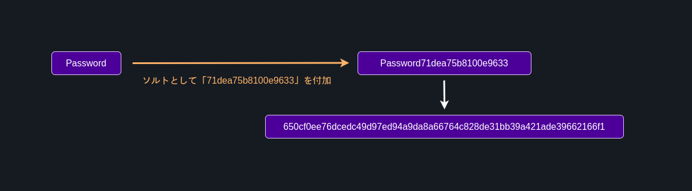
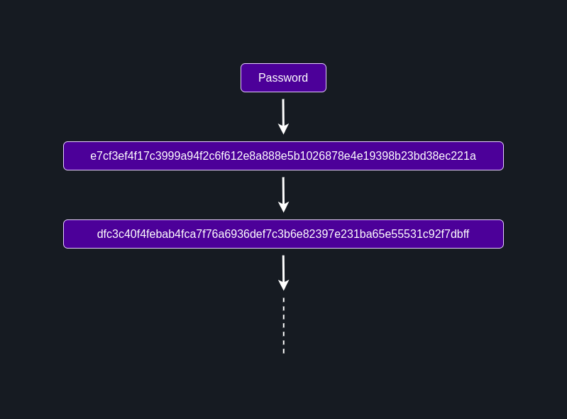

# 解答

大量の文字列のハッシュ値を全て求めて、ハッシュ値で比較すれば元のパスワードが分かりますね。

例えば、SHA-256で "Apple" をハッシュ化すると、"f223faa96f22916294922b171a2696d868fd1f9129302eb41a45b2a2ea2ebbfd" になります。つまり、流出したデータの中に "f223faa96f22916294922b171a2696d868fd1f9129302eb41a45b2a2ea2ebbfd" があれば、そのパスワードは "Apple" であると分かります。

> 一般に使用されるハッシュアルゴリズムでは、衝突 (異なる入力文字列に対して同一のハッシュ値が得られること) は滅多に起こるものではなく、さらに入力が少し異なるだけでハッシュ値は大きく異なるものになるという性質があります。
> 例：「AAAAAAAAAA」「BAAAAAAAAA」「AAAAAAAAAB」のSHA-256ハッシュはそれぞれ、「1d65bf29403e4fb1767522a107c827b8884d16640cf0e3b18c4c1dd107e0d49d」「76e34bed729e3560c0a0e0732c61e15f1c6dd31755c6602c7efe1d194726eb0a」「06b531c3de994b567583423c832668bb5a64c511dd05797272ff4bf17eb2cb8b」であり、入力が少し異なるだけでハッシュ値が大きく異なることが確認できます。

これらを踏まえて、大量の文字列のハッシュ値を全て求めてそれぞれ比較することで、元の文字列を割り出すことができます。このような攻撃を **総当たり攻撃 (ブルートフォースアタック)** と呼びます。

しかし、実際は総当たり攻撃は時間がかかるため、毎回総当たりで解析していては時間がかかります。そこで、予め大量の文字列のハッシュ値を計算した上で保存しておき、それを用いて高速に大量のハッシュ値を照合することが多く、これを **レインボー攻撃** と呼びます。

-------------

さて、今回はそんな都合の良い表は持ち合わせていませんので、総当たりで解析しましょう。しかし、闇雲に総当たりしていても時間ばかりかかりますね。まず求めるべきハッシュ値はどのような文字列でしょうか。それは、「よく使われるパスワード」です。

NordPassによって [Top 200 most common passwords](https://nordpass.com/most-common-passwords-list/?utm_source=twitter&utm_medium=social&utm_campaign=top200passords2021) が公開されているので、今回はこれを使いましょう。ちなみに他の同様のリストを見ても、ほぼ同様の結果となっています。

以下、地域設定をJapanに絞り込んだ場合のものを示します。

<details><summary>Top 200 most common passwords</summary>

```
"password"
"123456"
"123456789"
"12345678"
"1qaz2wsx"
"member"
"asdfghjk"
"12345"
"password1"
"1234567890"
"asdfghjkl"
"asdf1234"
"qwertyuiop"
"qwerty"
"sakura"
"1q2w3e4r"
"qwer1234"
"abcd1234"
"zaq12wsx"
"qwertyui"
"takahiro"
"1234567"
"987654321"
"zxcvbnm"
"fujitvpass"
"baseball"
"1234qwer"
"doraemon"
"12341234"
"qazwsxedc"
"masahiro"
"qazwsx"
"1qazxsw2"
"himawari"
"nekoneko"
"hiroyuki"
"kuroneko"
"lovelove"
"abc123"
"iloveyou"
"112233"
"asdfasdf"
"takayuki"
"11223344"
"88888888"
"nikoniko"
"yamamoto"
"yuantuo"
"nakamura"
"isme"
"654321"
"watanabe"
"tomotomo"
"hirohiro"
"masamasa"
"hanahana"
"q1w2e3r4"
"marlboro"
"123123123"
"kirakira"
"masayuki"
"qwe123"
"hogehoge"
"12344321"
"1234abcd"
"takataka"
"123321"
"onepiece"
"sakurasaku"
"asdfgh"
"zaq1xsw2"
"takoyaki"
"tomohiro"
"abc12345"
"666666"
"yukiyuki"
"1q2w3e"
"morimori"
"123qwe"
"kamikaze"
"sunshine"
"qweasdzxc"
"123456789a"
"kamisama"
"princess"
"dragon"
"korokoro"
"soccer"
"kawasaki"
"ryousuke"
"147258369"
"abcdefgh"
"mokomoko"
"starwars"
"zxcvbn"
"nyanmage"
"7777777"
"superman"
"87654321"
"ganndamu"
"kumakuma"
"anpanman"
"makoto"
"football"
"yasuhiro"
"chocolate"
"sakusaku"
"makimaki"
"sakamoto"
"yokohama"
"kojikoji"
"passpass"
"kazuhiro"
"hiroki"
"qwerasdf"
"arigatou"
"qwerty123"
"freedom"
"banana"
"darkness"
"zxcv1234"
"aisiteru"
"daisuke"
"infinity"
"masaki"
"takanori"
"basketball"
"kenken"
"takashi"
"doragonn"
"kazuki"
"takuya"
"computer"
"masanori"
"uchipass"
"1q2w3e4r5t"
"radwimps"
"sasasa"
"1qaz1qaz"
"daisuki"
"kazukazu"
"haruharu"
"higurasi"
"passw0rd"
"kokoro"
"a1b2c3d4"
"redstone"
"kanakana"
"tomoyuki"
"ultimate"
"masataka"
"masamune"
"hasegawa"
"slipknot"
"pakistan"
"orange"
"mayumayu"
"haruka"
"takahasi"
"mikimiki"
"asdfzxcv"
"zxc123"
"miyuki"
"michelle"
"yorosiku"
"sinigami"
"rakisuta"
"xxxxxx"
"korosuke"
"marumaru"
"tomato"
"unkounko"
"takutaku"
"samurai"
"warcraft"
"kerokero"
"123qweasd"
"hayabusa"
"gundam"
"abcdefg"
"internet"
"asasas"
"sasasasa"
"marimari"
"satoshi"
"keisuke"
"qawsedrf"
"piyopiyo"
"yakiniku"
"akasatana"
"blackcat"
"yarakasita"
"yamazaki"
"nightmare"
"takahashi"
"taketake"
"ragnarok"
"metallica"
"tsuyoshi"
"123123"
```

> [Top 200
most common passwords | Japan](https://nordpass.com/most-common-passwords-list/?utm_source=twitter&utm_medium=social&utm_campaign=top200passords2021)
</details>

さて、これらの大量の文字列のハッシュ値を求めるために、簡単なプログラムを組みましょう。以下、PythonおよびNode.jsでハッシュ値を求めるプログラムを示します。これを参考に作ってみてください。

### Python
```python
import hashlib

input = 'hoge'
hash = hashlib.sha256(input.encode('utf-8')).hexdigest()

print(hash)
```

### Node.js
```js
const crypto = require("crypto");

const input = 'hoge'
const hash = crypto.createHash("sha256").update(input).digest("hex");

console.log(hash)
```

ここまででまだ時間が余っているガチプロの皆様、ここからはいよいよ総当たりで解析していきましょう。

以下に、アルファベット大文字小文字および数字からなる1桁または2桁のパスワードに対する全てのSHA-256ハッシュを計算するプログラムの例を示します。

```python
import string
import hashlib

hashes = {}

# a-z, A-Z, 0-9
chars = list(string.ascii_lowercase) + \
    list(string.ascii_uppercase) + \
    list([str(i) for i in range(0, 10)])

# a-z, A-Z, 0-9 および aa-99 までのハッシュ値を計算
for i in chars:
    hashes[i] = hashlib.sha256(i.encode('utf-8')).hexdigest()

    for j in chars:
        hashes[(i + j)] = hashlib.sha256((i + j).encode('utf-8')).hexdigest()

print(hashes)
```

参考までに、このWebサービスで有効なパスワードは、`ABCDEFGHIJKLMNOPQRSTUVWXYZabcdefghijklmnopqrstuvwxyz0123456789-_/*+.,!#$%&()~|` から重複を含む1文字以上を組み合わせた任意の文字列です。

# 対策
パスワードを平文で保存することはもちろん駄目ですが、ただハッシュ化するだけでもまだ足りないということが分かっていただけたかと思います。

では、総当たり攻撃に対する対策としては何が考えられるでしょうか。現代では、以下のような対策が行われます。

- 優れたハッシュアルゴリズムを使用すること
- ソルト (あるいはペッパー) を加える
- ストレッチング処理を行う
  
優れたハッシュアルゴリズムとは、原像攻撃や誕生日攻撃などと呼ばれる攻撃に対して強いアルゴリズムのことを指しています。

> [原像攻撃](https://ja.wikipedia.org/wiki/%E5%8E%9F%E5%83%8F%E6%94%BB%E6%92%83)

> [誕生日攻撃](https://ja.wikipedia.org/wiki/%E8%AA%95%E7%94%9F%E6%97%A5%E6%94%BB%E6%92%83)

2つ目のソルトとは、入力に対してさらに文字列を追加し、長さを確保するものです。ソルトはランダムに生成された文字列であることが望ましいです。さらに、ソルトをパスワードと同じ場所に保存していた場合、パスワードの流出とともにソルトも流出してしまう危険性があるため、パスワードとは別の場所にソルトを保存しておく場合があり、これをソルトと区別してペッパー (シークレットソルト) と呼びます。



3つ目のストレッチング処理とは、ハッシュ化を複数回行うことを指します。現代では1000回前後行うのが一般的ではないかと思います。



これらの問題を解決した手法として、パスワードをDBに保存する必要がある場合は、bcryptなどを用いるのが良いでしょう。

ただし、これらはあくまで情報漏洩の最後の砦でしかありません。解析に時間をかけ、その間に流出した範囲のパスワードを無効化したり、パスワードの再設定をユーザーに促すわけです。情報を絶対に漏らさないことを念頭に置き、それでも漏れてしまった場合の被害を最小限にするために、安全な方法で情報を保管するようにしましょう。
